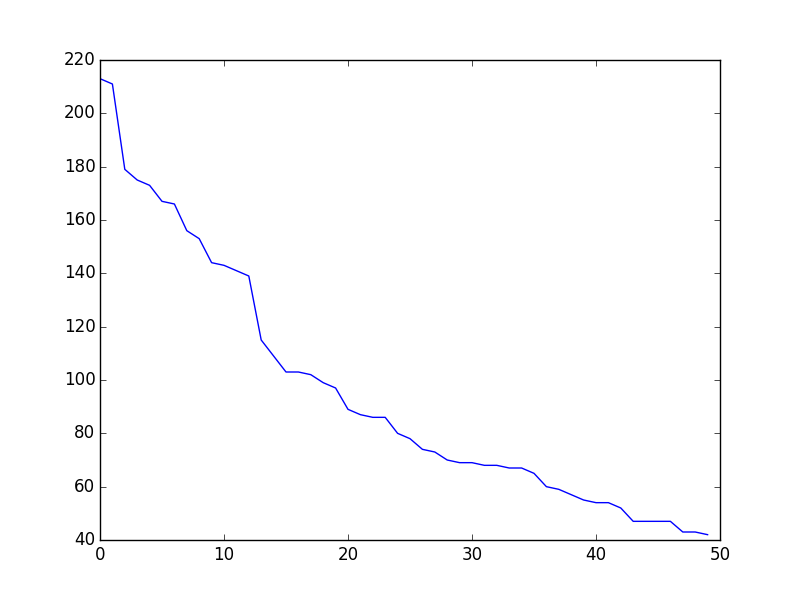

TODO2: create phylogenetic tree of vimrcs
TODO3: add all options from option.c (see src/nvim/option.c)
TODO4: cover the entire github periodically

This script scrapes vimrc's hosted in github and returns the most commonly used vim configurations.

```python eigenvimrc.py```

The "voting" process may iterate as follows:

```python
def vote(default):
    vimrcs = people_curate_their_vimrc()
    sleep(a_month)
    new_default = most_common_50_percent(vimrcs)
    if new_default != default:
        return vote(new_default)
    else:
        return new_default
```

# Install
3. Make sure pathogen is available and ```execute pathogen#infect()``` is in ```~/.vimrc```
2. ```cd ~/.vim/bundle```
3. ```git clone git://github.com/rht/eigenvimrc.git```

# Result
```set nocompatible``` > ```syntax on```


Most common vim config out of 13759 vimrc's

0. ```set nocompatible``` 83.33%
1. ```syntax on``` 79.78%
2. ```set number``` 74.55%
3. ```set expandtab``` 71.10%
4. ```set incsearch``` 68.44%
5. ```set hlsearch``` 67.92%
6. ```set laststatus=2``` 67.76%
7. ```filetype plugin indent on``` 67.59%
8. ```set ruler``` 60.38%
9. ```set ignorecase``` 59.67%
10. ```set autoindent``` 53.00%
11. ```set showcmd``` 50.05%
12. ```set backspace=indent,eol,start``` 47.30%
13. ```set wildmenu``` 45.68%
14. ```set background=dark``` 40.45%
15. ```let mapleader=","``` 39.67%
16. ```set smartcase``` 38.73%
17. ```filetype off``` 37.95%
18. ```set tabstop=2``` 36.87%
19. ```set shiftwidth=4``` 36.79%
20. ```set showmatch``` 36.66%
21. ```set tabstop=4``` 36.55%
22. ```set cursorline``` 36.49%
23. ```set t_Co=256``` 35.90%
24. ```set nobackup``` 34.89%
25. ```set shiftwidth=2``` 34.49%
26. ```set encoding=utf-8``` 33.50%
27. ```set mouse=a``` 32.01%
28. ```set hidden``` 30.77%
29. ```set showmode``` 27.84%
30. ```set smarttab``` 27.20%
31. ```set noswapfile``` 26.27%
32. ```set nowrap``` 26.16%
33. ```set title``` 25.41%
34. ```autocmd!``` 25.02%
35. ```set list``` 25.00%
36. ```set noerrorbells``` 23.56%
37. ```filetype plugin on``` 23.10%
38. ```syntax enable``` 22.85%
39. ```set smartindent``` 22.26%
40. ```set softtabstop=4``` 21.98%
41. ```set scrolloff=3``` 21.14%
42. ```filetype on``` 21.08%
43. ```set relativenumber``` 19.26%
44. ```autocmd BufReadPost *``` 18.46%
45. ```set autoread``` 18.45%
46. ```set softtabstop=2``` 18.16%
47. ```colorscheme solarized``` 18.00%
48. ```set ttyfast``` 17.73%
49. ```set clipboard=unnamed``` 17.62%
50. ```filetype indent on``` 17.41%
51. ```set gdefault``` 16.73%
52. ```set undofile``` 14.96%
53. ```set visualbell``` 14.88%
54. ```set nostartofline``` 14.38%
55. ```set nowritebackup``` 14.37%
56. ```set splitright``` 14.36%
57. ```set history=1000``` 14.35%
58. ```set splitbelow``` 13.79%
59. ```set rtp+=~/.vim/bundle/vundle/``` 13.55%
60. ```set wrap``` 13.18%
61. ```set history=50``` 12.84%
62. ```set modeline``` 12.42%
63. ```set shortmess=atI``` 12.38%
64. ```set guioptions-=T``` 11.91%
65. ```set shiftround``` 11.75%
66. ```set undodir=~/.vim/undo``` 11.74%
67. ```set backupdir=~/.vim/backups``` 10.76%
68. ```set wildmode=list:longest``` 10.75%
69. ```set esckeys``` 10.75%
70. ```set encoding=utf-8 nobomb``` 10.67%
71. ```let save_cursor=getpos(".")``` 10.59%
72. ```set directory=~/.vim/swaps``` 10.36%
73. ```let old_query=getreg('/')``` 10.32%
74. ```set backspace=2``` 9.46%
75. ```set lazyredraw``` 9.14%
76. ```set rtp+=~/.vim/bundle/Vundle.vim``` 9.13%
77. ```nnoremap k gk``` 8.77%
78. ```nnoremap j gj``` 8.76%
79. ```set backup``` 8.71%
80. ```colorscheme molokai``` 8.23%
81. ```set binary``` 8.10%
82. ```set noeol``` 8.06%
83. ```set linebreak``` 7.99%
84. ```set nofoldenable``` 7.98%
85. ```set numberwidth=5``` 7.92%
86. ```Plugin 'gmarik/Vundle.vim'``` 7.87%
87. ```set novisualbell``` 7.78%
88. ```let g:airline_powerline_fonts=1``` 7.76%
89. ```set fileencoding=utf-8``` 7.74%
90. ```set wildmode=list:longest,list:full``` 7.66%
91. ```set exrc``` 7.58%
92. ```function! StripWhitespace()``` 7.44%
93. ```set secure``` 7.44%
94. ```autocmd BufNewFile,BufRead *.json setfiletype json syntax=javascript``` 7.40%
95. ```noremap <leader>W :w !sudo tee % > /dev/null<CR>``` 7.33%
96. ```vnoremap < <gv``` 7.21%
97. ```set foldenable``` 7.19%
98. ```vnoremap > >gv``` 7.17%
99. ```set foldmethod=indent``` 7.07%

# Colorscheme stat
0. solarized 25.00%
1. molokai 11.44%
2. desert 6.19%
3. badwolf 4.33%
4. jellybeans 3.99%
5. github 2.88%
6. default 1.86%
7. hybrid 1.84%
8. vividchalk 1.72%
9. railscasts 1.71%

# Plugin manager stat

vam: 0.34%
vundle: 10.39%
neobundle: 4.40%
others or none: 69.96%
dein: 0.00%
pathogen: 14.91%


# Plot
Strangely it doesn't follow the power law distribution. Likely because some settings are highly correlated with the others.


# Data

Last updated Mar 31 2017.
Repository list is queried from [http://ghtorrent.org/dblite/](http://ghtorrent.org/dblite/)

```SELECT * FROM projects WHERE language = 'VimL' AND ((name = 'dotfiles') OR (name = 'vimrc'))```
