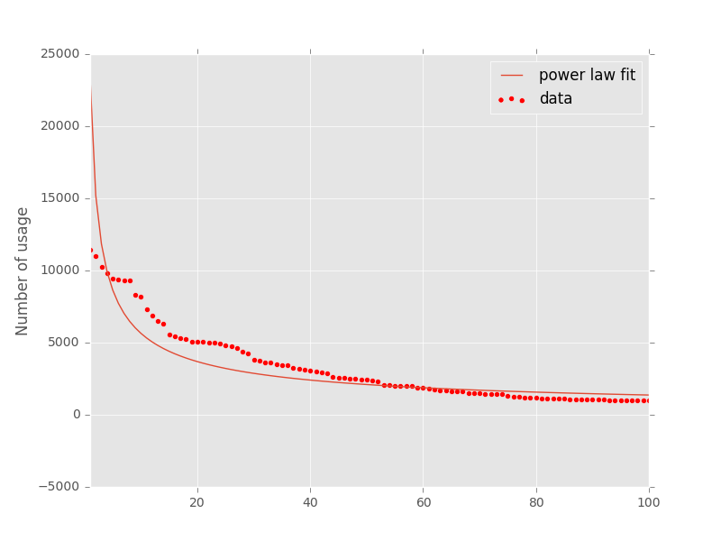

TODO2: create phylogenetic tree of vimrcs
TODO3: add all options from option.c (see src/nvim/option.c)
TODO4: cover the entire github periodically

This script scrapes vimrc's hosted in github and returns the most commonly used vim configurations.

```python eigenvimrc.py```

The "voting" process may iterate as follows:

```python
def vote(default):
    vimrcs = people_curate_their_vimrc()
    sleep(a_month)
    new_default = most_common_50_percent(vimrcs)
    if new_default != default:
        return vote(new_default)
    else:
        return new_default
```

#Install
3. Make sure pathogen is available and ```execute pathogen#infect()``` is in ```~/.vimrc```
2. ```cd ~/.vim/bundle```
3. ```git clone git://github.com/rht/eigenvimrc.git```

#Result
```syntax on``` > ```set nocompatible```

Most common vim config out of 13759 vimrc's

0. ```syntax on``` 69.79%
1. ```set number``` 58.58%
2. ```set nocompatible``` 57.35%
3. ```filetype plugin indent on``` 52.06%
4. ```set expandtab``` 51.86%
5. ```set laststatus=2``` 47.60%
6. ```set hlsearch``` 46.29%
7. ```set incsearch``` 39.17%
8. ```set ignorecase``` 38.12%
9. ```let mapleader=","``` 38.01%
10. ```set background=dark``` 37.71%
11. ```set backspace=indent,eol,start``` 36.34%
12. ```set ruler``` 33.57%
13. ```set autoindent``` 33.42%
14. ```set tabstop=2``` 31.54%
15. ```set wildmenu``` 30.63%
16. ```set encoding=utf-8``` 29.40%
17. ```set t_Co=256``` 29.22%
18. ```set smartcase``` 28.96%
19. ```set shiftwidth=4``` 28.55%
20. ```set tabstop=4``` 28.22%
21. ```set showcmd``` 27.28%
22. ```set shiftwidth=2``` 26.22%
23. ```set nobackup``` 25.63%
24. ```set cursorline``` 25.47%
25. ```filetype off``` 25.07%
26. ```autocmd!``` 25.02%
27. ```set mouse=a``` 24.40%
28. ```set list``` 22.02%
29. ```set showmatch``` 21.45%
30. ```syntax enable``` 19.35%
31. ```set noswapfile``` 19.33%
32. ```filetype plugin on``` 19.07%
33. ```set hidden``` 18.85%
34. ```set smartindent``` 18.59%
35. ```autocmd BufReadPost *``` 18.45%
36. ```set smarttab``` 17.64%
37. ```colorscheme solarized``` 17.53%
38. ```filetype on``` 17.31%
39. ```set softtabstop=4``` 17.09%
40. ```set showmode``` 16.97%
41. ```set title``` 16.77%
42. ```set noerrorbells``` 16.75%
43. ```set relativenumber``` 15.19%
44. ```set nowrap``` 15.02%
45. ```set ttyfast``` 14.88%
46. ```set scrolloff=3``` 14.13%
47. ```set clipboard=unnamed``` 13.98%
48. ```filetype indent on``` 13.84%
49. ```set rtp+=~/.vim/bundle/vundle/``` 13.45%
50. ```set softtabstop=2``` 13.01%
51. ```set nowritebackup``` 12.61%
52. ```set gdefault``` 11.55%
53. ```set undodir=~/.vim/undo``` 11.44%
54. ```set autoread``` 11.36%
55. ```set modeline``` 11.09%
56. ```let save_cursor=getpos(".")``` 10.58%
57. ```set backupdir=~/.vim/backups``` 10.57%
58. ```set directory=~/.vim/swaps``` 10.33%
59. ```let old_query=getreg('/')``` 10.32%
60. ```set undofile``` 10.10%
61. ```set nostartofline``` 10.04%
62. ```set splitright``` 9.61%
63. ```set splitbelow``` 9.07%
64. ```set rtp+=~/.vim/bundle/Vundle.vim``` 9.06%
65. ```set shortmess=atI``` 8.84%
66. ```nnoremap k gk``` 8.77%
67. ```nnoremap j gj``` 8.76%
68. ```set wrap``` 8.72%
69. ```set binary``` 8.07%
70. ```set noeol``` 8.05%
71. ```set encoding=utf-8 nobomb``` 7.94%
72. ```set esckeys``` 7.89%
73. ```set guioptions-=T``` 7.88%
74. ```colorscheme molokai``` 7.78%
75. ```let g:airline_powerline_fonts=1``` 7.55%
76. ```Plugin 'gmarik/Vundle.vim'``` 7.54%
77. ```set wildmode=list:longest,list:full``` 7.46%
78. ```set numberwidth=5``` 7.46%
79. ```function! StripWhitespace()``` 7.44%
80. ```set visualbell``` 7.39%
81. ```autocmd BufNewFile,BufRead *.json setfiletype json syntax=javascript``` 7.39%
82. ```set fileencoding=utf-8``` 7.35%
83. ```noremap <leader>W :w !sudo tee % > /dev/null<CR>``` 7.32%
84. ```au BufReadPost * set relativenumber``` 7.04%
85. ```set exrc``` 6.95%
86. ```set secure``` 6.90%
87. ```nnoremap Y y$``` 6.76%
88. ```vnoremap < <gv``` 6.59%
89. ```vnoremap > >gv``` 6.56%
90. ```let g:Powerline_symbols='fancy'``` 6.52%
91. ```set shiftround``` 6.45%
92. ```set termencoding=utf-8``` 6.37%
93. ```set history=1000``` 6.34%
94. ```set incsearch		``` 6.32%
95. ```set novisualbell``` 6.29%
96. ```nnoremap ; :``` 6.29%
97. ```set laststatus=2 ``` 6.26%
98. ```set autoindent		``` 6.17%
99. ```set lazyredraw``` 6.14%


#Plot
Strangely it doesn't follow the power law distribution. Likely because some settings are highly correlated with the others.


#Data
Repository list is queried from [http://ghtorrent.org/dblite/](http://ghtorrent.org/dblite/)

```SELECT * FROM projects WHERE language = 'VimL' AND ((name = 'dotfiles') OR (name = 'vimrc'))```
